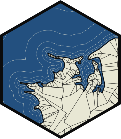
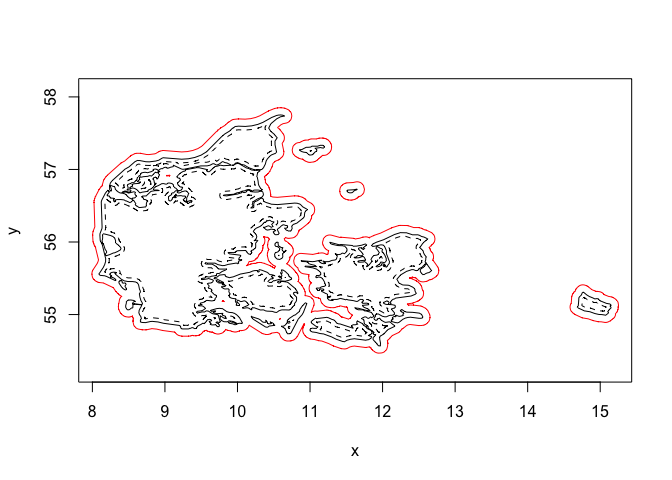

<!-- README.md is generated from README.Rmd. Please edit that file -->

# boundaries 

<!-- badges: start -->

[](https://lifecycle.r-lib.org/articles/stages.html#experimental)
[](https://CRAN.R-project.org/package=boundaries)
[](https://app.codecov.io/gh/thomasp85/boundaries?branch=main)
[](https://github.com/thomasp85/boundaries/actions/workflows/R-CMD-check.yaml)
<!-- badges: end -->

boundaries is a utility package for the euclid ecosystem providing tools
for working (primarily) with polygon boundaries. Offsetting/insetting
and simplification are among the primary algorithms provided by this
package, but it serves as the place for any function used to somehow
alter or do calculations on the polygonal rings

## Installation

You can install the development version of boundaries like so:

``` r
pak::pkg_install("thomasp85/boundaries")
```

## Example

Below we show how to simplify a complex polygon, by reducing the number
of vertices to a tenth of the original count:

``` r
library(boundaries)
#> Loading required package: euclid
#> 
#> Attaching package: 'euclid'
#> The following object is masked from 'package:stats':
#> 
#>     line
#> The following object is masked from 'package:base':
#> 
#>     union
denmark <- polyclid::denmark()

sum(cardinality(denmark))
#> [1] 2165
```

``` r
denmark_simple <- simplify_poly(
  denmark, 
  stop = "below count ratio", 
  stop_threshold = 0.1
)
sum(cardinality(denmark_simple))
#> [1] 214
```

As can be seen the simplified polygon retains its features quite well

``` r
plot(denmark)
euclid_plot(denmark_simple, lty = 2, border = "red")
```


Offsetting and insetting can be calculated either based on the straight
skeleton which retains the vertex angles, or using minkowski sum with a
disc which introduces rounding of obtuse angles. Here we show insetting
and offsetting with minkowski

``` r
plot(denmark)

inset <- minkowski_offset(denmark, -0.05, arc_segments = 10)
euclid_plot(inset, lty = 2)

offset <- minkowski_offset(denmark, 0.1, arc_segments = 10)
euclid_plot(union(offset), border = "red")
```



There are more functions provided in the packages. Explore the docs to
learn more

## Code of Conduct

Please note that the boundaries project is released with a [Contributor
Code of
Conduct](https://contributor-covenant.org/version/2/1/CODE_OF_CONDUCT.html).
By contributing to this project, you agree to abide by its terms.
